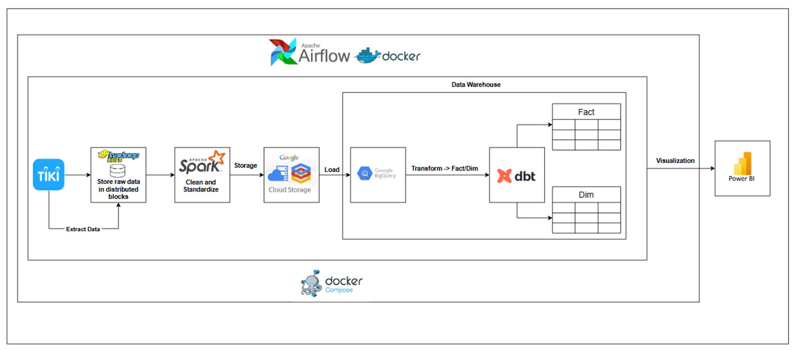
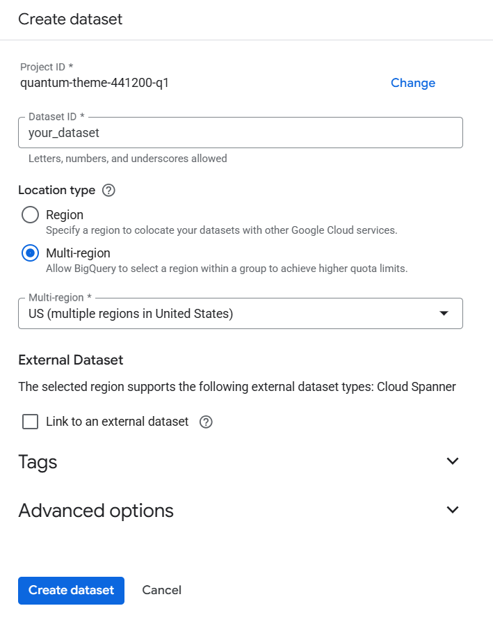
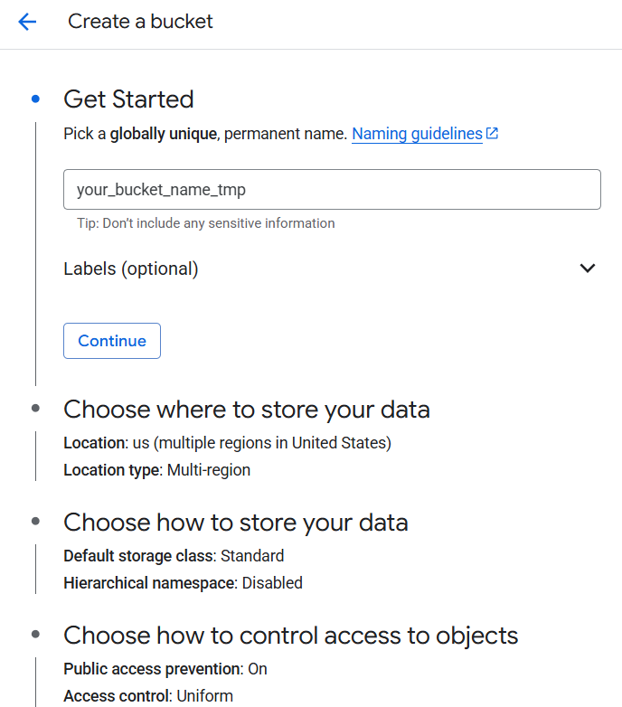
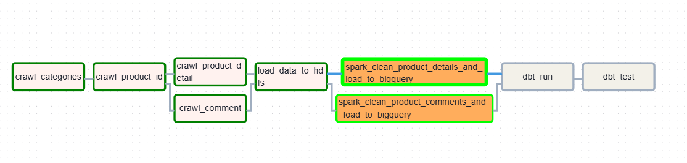
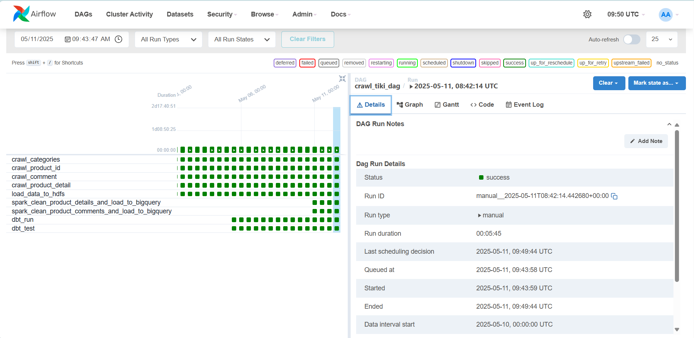
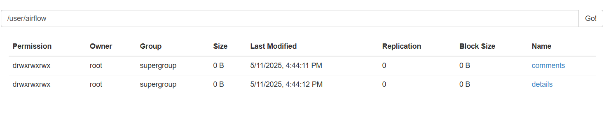
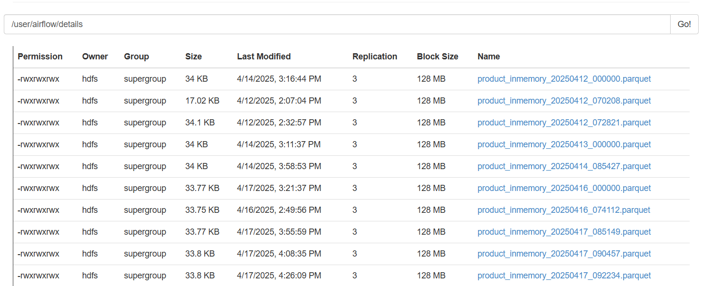
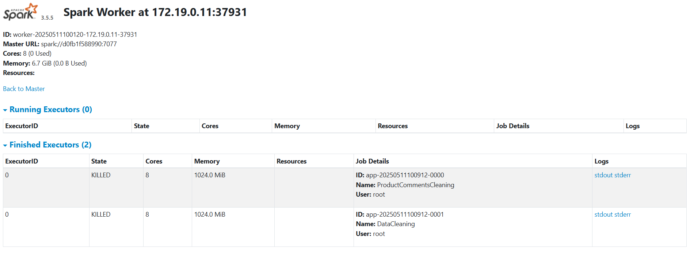
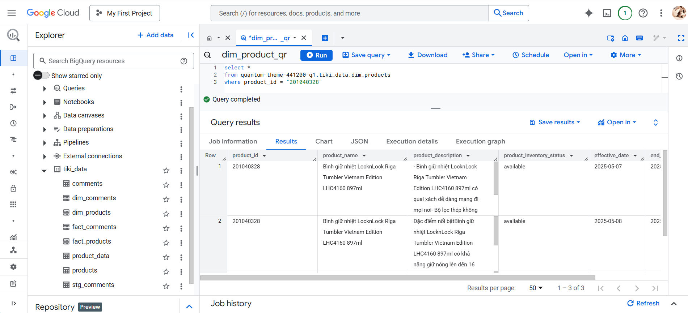
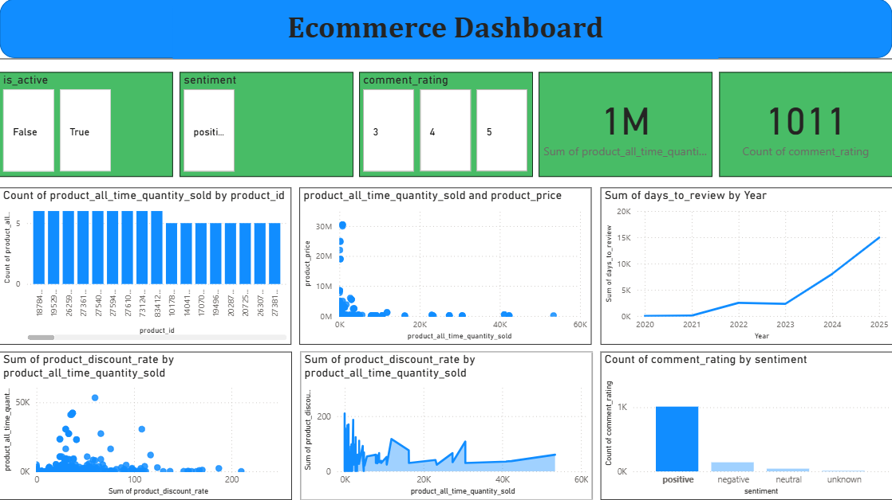

# Ecommerce Data Warehouse Pipeline

## Giới thiệu
Dự án này là một pipeline xử lý dữ liệu thương mại điện tử, được thiết kế để thu thập, xử lý và lưu trữ dữ liệu từ nguồn Tiki. Pipeline sử dụng các công nghệ hiện đại như Apache Airflow, Apache Spark, Hadoop Distributed File System (HDFS) và Google BigQuery để xây dựng một data warehouse hoàn chỉnh.

## Data tools và services
- **Data Source**: Dữ liệu từ Tiki
- **Data Processing**: Apache Spark
- **Workflow Orchestration**: Apache Airflow
- **Data Storage**: HDFS và Google BigQuery
- **Containerization**: Docker và Docker Compose
- **Data Transformation**: dbt (data build tool)
- **Data Visualization**: Microsoft Power BI
- **Temporary Storage**: Google Cloud Storage (GCS)

## Luồng dữ liệu
1. **Thu thập dữ liệu**: Dữ liệu được crawl từ API của Tiki thông qua các HTTP requests tự động.
2. **Lưu trữ dữ liệu thô**: Raw data được đưa trực tiếp vào Hadoop Distributed File System (HDFS) để lưu trữ an toàn và có khả năng mở rộng.
3. **Xử lý dữ liệu**: Apache Spark được sử dụng để làm sạch và chuẩn hóa dữ liệu, bao gồm việc loại bỏ dữ liệu trùng lặp, chuyển đổi kiểu dữ liệu và xử lý các giá trị null.
4. **Trung chuyển dữ liệu**: Dữ liệu sau khi xử lý được đưa vào Google Cloud Storage (GCS) như một kho lưu trữ tạm thời.
5. **Tải dữ liệu vào Data Warehouse**: Từ GCS, dữ liệu được load vào BigQuery để phục vụ phân tích.
6. **Mô hình hóa dữ liệu**: dbt (data build tool) được sử dụng để biến đổi dữ liệu và tạo các bảng dimension (sử dụng phương pháp SCD Type 2 cho việc theo dõi lịch sử thay đổi) và các bảng fact.
7. **Tự động hóa**: Toàn bộ quá trình từ thu thập đến mô hình hóa dữ liệu được tự động hóa và điều phối bởi Apache Airflow, đảm bảo tính nhất quán và độ tin cậy của pipeline.
8. **Container**: Docker được sử dụng để đóng gói toàn bộ ứng dụng, bao gồm Airflow, Spark và HDFS, giúp dễ dàng triển khai và quản lý.
9. **Trực quan hóa**: Microsoft Power BI được sử dụng để kết nối với BigQuery và tạo các báo cáo, dashboard trực quan để phân tích dữ liệu.



## Yêu cầu hệ thống
- Docker và Docker Compose
- Python 3.8+
- Tài khoản Google Cloud Platform với quyền truy cập BigQuery
- Key file của service account được tạo trong Google Cloud Platform

## Cài đặt và Chạy

### 1. Clone repository
```bash
git clone https://github.com/VuTrinhNguyenHoang/Ecommerce-DWH-BigQuery.git
cd Ecommerce-DWH-BigQuery
```

### 2. Thiết lập môi trường
- Sửa đổi file ``.env`` với các thông tin cần thiết
```
GCP_PROJECT_ID=your_project_id
GOOGLE_APPLICATION_CREDENTIALS=/opt/airflow/keys/your_key_file.json
DATASET_NAME=your_dataset_name
BUCKET_NAME = your_bucket_name
LOCATION = your_location
```

### 3. Khởi động dịch vụ
```bash
docker-compose up -d
```

### 4. Tạo connection của Airflow với Spark
- Truy cập Airflow UI (username: admin, password: admin) (http://localhost:8080) → Admin → Connections → Nhấn ``+``
- Cấu hình:
    + Conn Id: spark_default
    + Conn Type: Spark
    + Host: spark://spark-master
    + Port: 7077

### 5. Cấu hình Google Cloud Platform
1. Tạo dataset ``your_dataset_name``



2. Tạo cloud storage bucket ``your_bucket_name``



3. Tạo table dim_products trong dataset ``your_dataset_name``
```
CREATE TABLE your_dataset_name.dim_products (
    product_id STRING,
    product_name STRING,
    product_description STRING,
    product_inventory_status STRING,
    effective_date DATE,
    end_date DATE,
    is_active BOOLEAN
) 
PARTITION BY effective_date

```
4. Tạo table fact_products trong dataset ``your_dataset_name``
```
CREATE TABLE `your_dataset_name.fact_products` (
  product_id STRING,
  snapshot_date DATE,
  product_all_time_quantity_sold INT64,
  product_stock_item_qty INT64,
  product_stock_item_max_sale_qty INT64,
  product_price FLOAT64,
  product_list_price FLOAT64,
  product_discount FLOAT64,
  product_discount_rate FLOAT64
)
PARTITION BY snapshot_date
```
5. Tạo table dim_comments trong dataset ``your_dataset_name``
```
CREATE TABLE your_dataset_name.dim_comments (
    comment_id STRING,
    product_id STRING,
    sentiment STRING,
    comment_content STRING,
    comment_rating INT64,
    created_at TIMESTAMP,
    purchased_at TIMESTAMP,
    days_to_review INT64,
    rating_valid BOOLEAN,
    effective_date DATE,
    end_date DATE,
    is_active BOOLEAN
) 
PARTITION BY effective_date
CLUSTER BY product_id
```
6. Tạo table fact_comments trong dataset ``your_dataset_name``
```
CREATE TABLE `your_dataset_name.fact_comments` (
  comment_id STRING NOT NULL,
  product_id STRING,
  days_to_review INT64,
  comment_rating INT64,
  comment_date DATE,
  snapshot_date DATE
)
PARTITION BY comment_date
CLUSTER BY product_id
```
### 6. Chạy Airflow DAG
- Truy cập Airflow UI (http://localhost:8080) → DAGs → crawl_tiki_dag → Nhấn ``Trigger DAG``



## Cấu trúc Data Warehouse

### Dimension Tables
1. **dim_products**: Lưu trữ thông tin chi tiết về sản phẩm
   - product_id
   - product_name
   - product_description
   - product_inventory_status
   - effective_date
   - end_date
   - is_active

2. **dim_comments**: Lưu trữ thông tin về đánh giá sản phẩm
   - comment_id
   - product_id
   - sentiment
   - comment_content
   - comment_rating
   - created_at
   - purchased_at
   - days_to_review
   - rating_valid
   - effective_date
   - end_date
   - is_active

### Fact Tables
1. **fact_products**: Lưu trữ các metrics về sản phẩm
   - product_id
   - snapshot_date
   - product_all_time_quantity_sold
   - product_stock_item_qty
   - product_stock_item_max_sale_qty
   - product_price
   - product_list_price
   - product_discount
   - product_discount_rate

2. **fact_comments**: Lưu trữ các metrics về đánh giá
   - comment_id
   - product_id
   - days_to_review
   - comment_rating
   - comment_date
   - snapshot_date


## Kết quả
### Airflow



### HDFS





### Spark



### BigQuery



### Power BI



